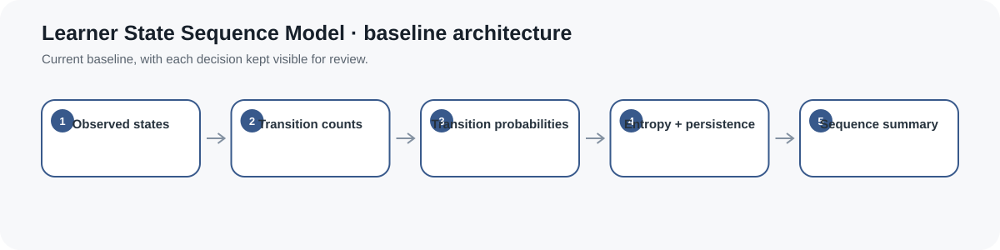
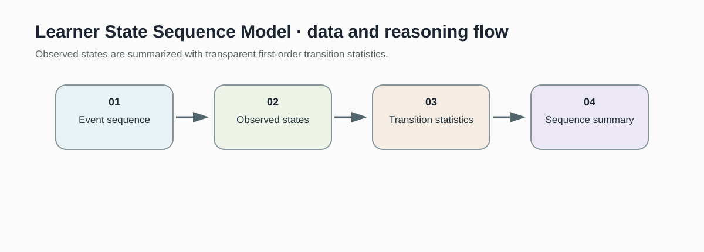
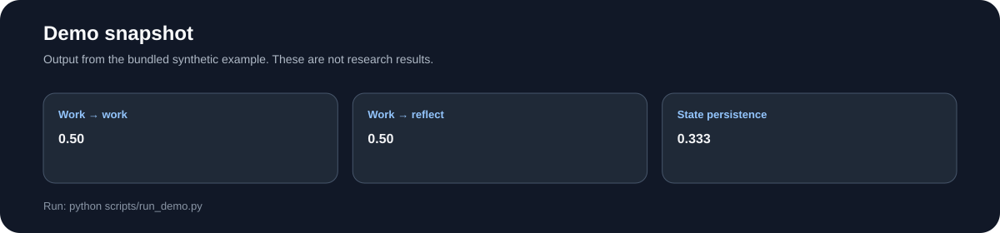
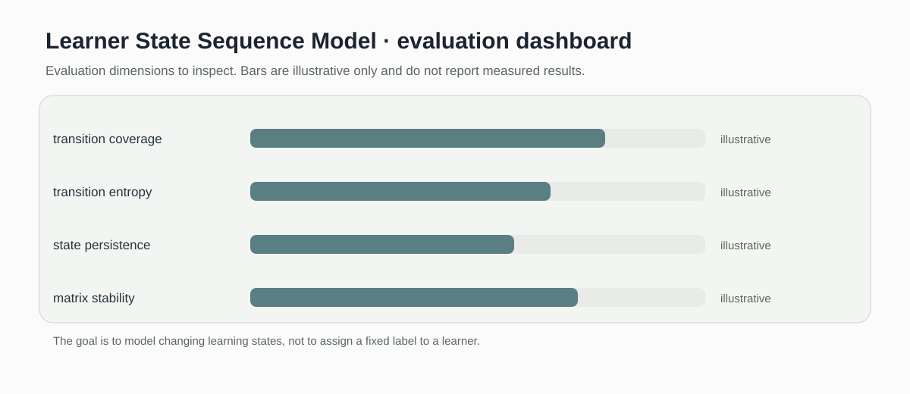

# Learner State Sequence Model

> Descriptive sequence analytics for learner state transitions, entropy, and persistence.

[](https://github.com/devissaputra/learner_state_sequence_model/actions/workflows/ci.yml)



**Area:** AI in Education (AIEd) · Sequential Learning Analytics & Self-Regulated Learning    
**Status:** working research prototype  
**Author:** Devis Wawan Saputra

## What this project is for

A learner session is a sequence, not a bag of clicks. This repository models transitions between states such as planning, working, and reflecting so researchers can study persistence, recovery, and where learners tend to get stuck.

**Who may find it useful:** Researchers working on process mining, self-regulated learning, and sequential learner modeling.

## Questions answered by the current baseline

1. Which first-order state transitions occur in an observed sequence?
2. How uncertain are outgoing transitions, as summarized by transition entropy?
3. How often do adjacent observations remain in the same state?

## How it works

The current module is descriptive rather than predictive. It counts adjacent state transitions, converts them to probabilities, calculates outgoing transition entropy, measures how often consecutive observations remain in the same state, and packages those statistics into a compact sequence summary.



Observed state sequences are converted directly into transition counts and probabilities, followed by entropy, persistence, and sequence-level descriptive summaries. There is no hidden encoder and no next-state classifier in this baseline.



This snapshot shows the bundled synthetic example for Learner State Sequence Model. It checks the software path; it is not an empirical performance result.

## Methods in the current baseline

- first-order transition matrix
- transition probabilities
- transition entropy
- state persistence
- sequence summary

## Data

Synthetic learner-state traces are included. A future adapter should map event streams with learner, timestamp, action, and state labels into ordered state sequences.

`data/README.md` documents the sample schema and the conditions that should be recorded before any real dataset is connected. Restricted or identifiable learner data should stay outside the repository.

## Run the demo

```bash
git clone https://github.com/devissaputra/learner_state_sequence_model.git
cd learner_state_sequence_model
python scripts/run_demo.py
python -m unittest discover -s tests -v
```

The demo uses the sequence plan, work, work, reflect. It prints a compact sequence summary containing the observation count, number of unique states, transition count, transition matrix, transition entropy, and state persistence.

## What to evaluate next

A predictive extension should be added only after state definitions and observation rules are validated. The first comparison should ask whether a simple transition model adds value beyond state frequency and persistence baselines.

## Evaluation view



The Learner State Sequence Model dashboard is an evaluation checklist rather than a result chart. The bars are illustrative only; the labels show the evidence a real study would need to collect.

## Limits and responsible use

The module assumes that state labels already exist and are meaningful. It does not infer states from raw learner behavior and it does not forecast the next state. See `docs/ethics_and_risks.md` for the broader risk review.

## Repository map

```text
.
├── .github/workflows/ci.yml
├── assets/
│   ├── architecture.svg
│   ├── data_flow.svg
│   ├── demo_snapshot.svg
│   └── evaluation_dashboard.svg
├── data/
│   ├── README.md
│   └── sample.csv
├── docs/
│   ├── ethics_and_risks.md
│   ├── related_work.md
│   └── research_protocol.md
├── reports/model_card.md
├── scripts/run_demo.py
├── src/learner_state_sequence_model/core.py
├── tests/test_core.py
├── CITATION.cff
├── LICENSE
├── pyproject.toml
└── README.md
```

## Research path

A credible next version would:

1. define and validate state labeling rules on real traces
2. measure transition stability across learners and contexts
3. compare a simple next-state baseline with more complex sequence models

## Related work

`docs/related_work.md` points to open projects that are relevant to this problem area. They are context for comparison and study design; this repository does not present their code as its own.

## Citation and license

`CITATION.cff` contains the software citation. The code and original SVG visuals use the MIT License. Any external dataset keeps its own license and usage conditions.
